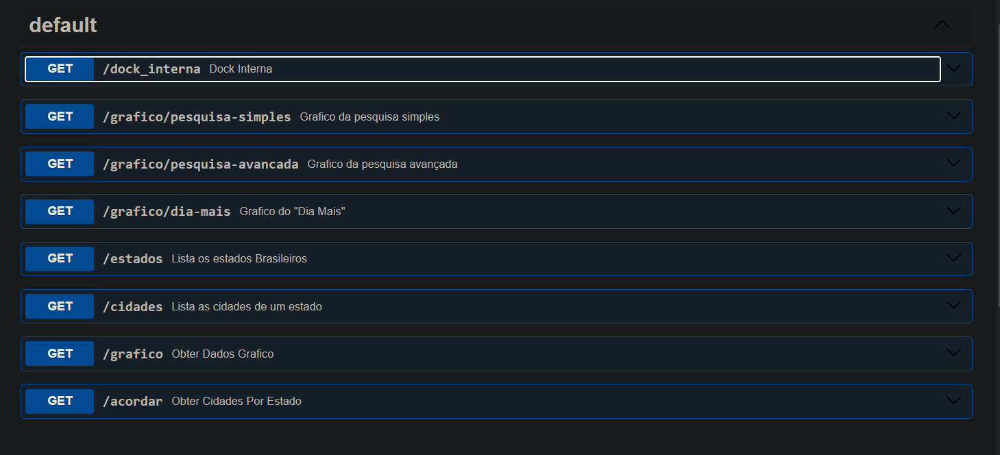
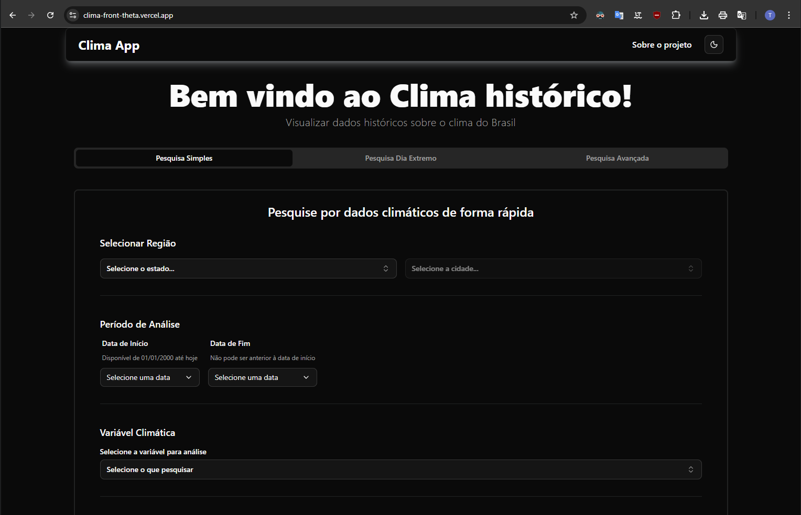
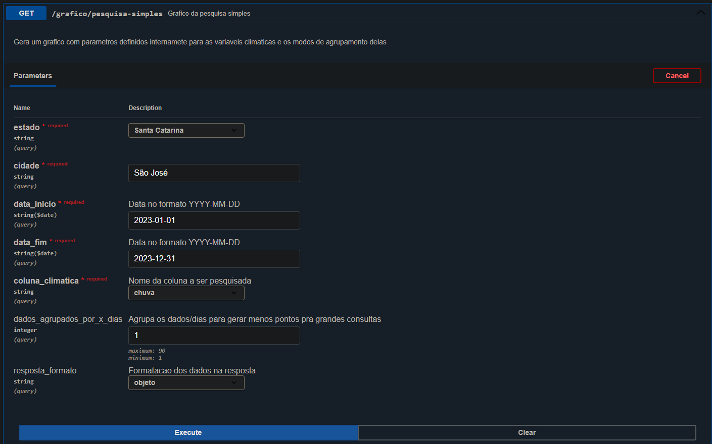
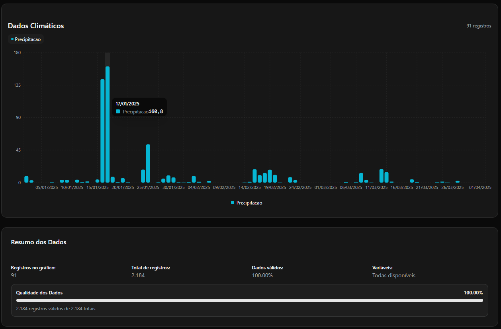
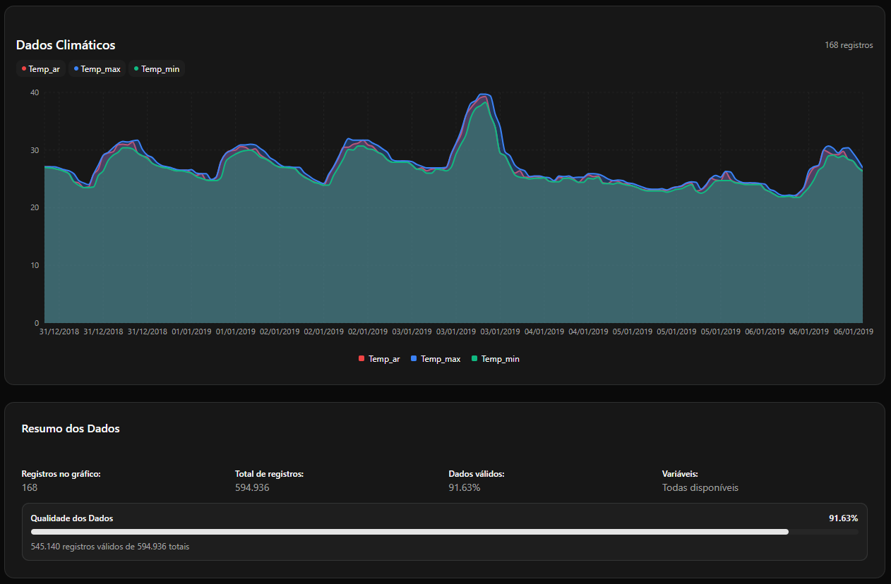

# Brasil ClimaAPI

**Brasil ClimaAPI** é uma API desenvolvida em **Python** utilizando **FastAPI** e **Pandas** que fornece dados climáticos históricos do Brasil. Site que usa [Clima App](https://clima-front-theta.vercel.app/), ou se quiser acessar diretamente [interface da API](https://projeto-clima-web-back.onrender.com/docs) *(pode levar alguns segundos para o servidor iniciar)*.

Com esta API, é possível obter dados reais e precisos para a geração de gráficos climáticos.

---

- [Princiapis rotas/funcionalidades](#Princiapis-rotas/funcionalidades)
- [Sobre o projeto](#Sobre-o-Projeto)
- [Divisão de tarefas](#Divisão-de-tarefas)
- [Principais tecnologias utilizadas](#Principais-Tecnologias-utilizadas)
- [Tecnologias e estrutura do projeto](#Principais-Tecnologias-utilizadas)


---

## Princiapis rotas/funcionalidades

- ✅ **Pesquisa Simples**  
  Gera um gráfico com parâmetros predefinidos para variáveis climáticas e modos de agrupamento.

- ✅ **Pesquisa "Dia Mais"**  
  Gera um gráfico do *dia mais* (ex.: dia mais quente, dia mais frio, dia mais chuvoso) dentro de um período informado.  
  Se o período não for informado, a busca é feita considerando todos os anos disponíveis.

- ✅ **Pesquisa Avançada**  
  Gera um gráfico com até **5 variáveis climáticas**, permitindo configuração detalhada do processamento interno. [Detalhes completos aqui](#Agrupamento-dos-dados)

---

## Sobre o Projeto

Este projeto surgiu de uma ideia minha de criar um aplicativo para visualizar dados climáticos. Inicialmente, eu havia projetado toda a [estrutura e processamento dos dados](#Funcionamento-Interno) para ser usada em um **app Python** com interface gráfica feita com a biblioteca **Tkinter**.

Porém, conversando com um amigo, percebemos que criar um **site** traria um alcance muito maior e tornaria o acesso mais simples — sem necessidade de instalar nada, apenas acessando via navegador. Assim, decidimos transformar a ideia em um projeto web: o **[Clima App](https://clima-front-theta.vercel.app/)**.

### Divisão de tarefas
- **Eu**: Desenvolvimento do **back-end** e geração dos dados/gráficos.  
- **Meu amigo**: Desenvolvimento do **front-end**.  
- **Colaboração**: Como eu tive a ideia original e já havia começado a fazer o app, também participei da criação do layout do site, documentação do projeto, definição de funcionalidades e arquitetura geral.

### Organização do projeto
Para o planejamento e execução do projeto usamos:
- **Notion** → Planejamento, documentação, cronogramas, divisão de tarefas e registro de ideias.
- **Discord** → Comunicação (voz e chat).

---

## Principais Tecnologias utilizadas e estrutura do projeto

- [Python] Linguagem de programaçao
- [FastAPI] Fazer o Back End
- [Pandas] Trabalhar com os dados
- [Uvicorn] para rodar o servidor

## Estrutura do projeto
app/  
├── main.py # Inicializa a API FastAPI  
├── api/ # Rotas da API  
├── core/ # Constantes, schemas e configs  
├── data/ # Dados em Parquet  
├── services/ # Serviços de gerar os "graficos" e funções auxiliares  
└── requirements.txt # Dependências do projeto  

## Funcionamento Interno

A API utiliza dados de duas fontes principais:  

- **INMET** — Dados climáticos históricos.  
- **IBGE** — Dados sobre cidades, estados e coordenadas geográficas.  

### 🗂 Preparação dos dados
1. **Coleta**: Os dados são baixados do INMET e IBGE.  
2. **Tratamento**: Todos os dados são processados e salvos em formato **`.parquet`**, o que garante maior velocidade em acessos futuros.  
3. **Indexação**: Para os dados climáticos, é criado um **índice anual** para agilizar buscas posteriores.

### 📍 Como funciona uma busca
- Cada rota de gráfico recebe:
  - **Cidade** e **Estado** → Convertidos para **coordenadas**.  
  - **Período de tempo**

> **Por que coordenadas?**  
> As estações meteorológicas do INMET não utilizam cidade/estado nos dados originais — apenas coordenadas. Por isso, essa conversão é necessária.

### 🔄 Processamento
1. Localiza-se no índice os dados climáticos correspondentes às coordenadas e período informado.  
2. Cria-se um **DataFrame único** com os dados encontrados.  
3. Agrupamento **por dia** — as 24 medições diárias viram um único registro.  
4. É feita uma análise de:
   - **Dados faltantes**
   - **Estações utilizadas**
5. Tudo é retornado pela API no formato solicitado.

---

## 📊 Rotas do FastAPI e imagens do site


### GET /grafico/pesquisa-simples



### GET /grafico/pesquisa-dia-mais


---

## Origem dos Dados

- Dados coletados do **Instituto Nacional de Meteorologia (INMET)** em formato tabular com 24 medições por dia do ano inteiro.
- Período: **2000 até 08/2025**, possivel mente mais atualizados.  
- Tratamento: remoção de valores impossíveis (chuva negativa, temperatura acima de 200°C, etc.).  
- **Não** é feita previsão para dados faltantes.

---
## Variáveis Climáticas

### 🌧 PRECIPITAÇÃO TOTAL, HORÁRIA (mm)  
Quantidade de chuva medida no período de 1 hora, em milímetros.  

### 🌬 PRESSÃO ATMOSFÉRICA AO NÍVEL DA ESTAÇÃO, HORÁRIA (mB ou hPa)
Pressão do ar na altitude da estação.  

### 📈 PRESSÃO ATMOSFÉRICA MÁX. NA HORA ANT. (mB)
Maior pressão atmosférica registrada na hora anterior.

### 📉 PRESSÃO ATMOSFÉRICA MÍN. NA HORA ANT. (mB)
Menor pressão atmosférica registrada na hora anterior.

### ☀ RADIAÇÃO GLOBAL (KJ/m²)
Energia solar recebida por m² (em quilojoules).  

### 🌡 TEMPERATURA DO AR – BULBO SECO, HORÁRIA (°C)
Temperatura do ar no abrigo meteorológico.  

### 💧 TEMPERATURA DO PONTO DE ORVALHO (°C)
Temperatura em que o ar atinge 100% de umidade e o orvalho se forma.

### 🌡 TEMPERATURA MÁXIMA NA HORA ANT. (°C)
Maior temperatura registrada na hora anterior.

### 🌡 TEMPERATURA MÍNIMA NA HORA ANT. (°C)
Menor temperatura registrada na hora anterior.

### 💧 TEMPERATURA ORVALHO MÁX. NA HORA ANT. (°C)
Maior ponto de orvalho na hora anterior.

### 💧 TEMPERATURA ORVALHO MÍN. NA HORA ANT. (°C)
Menor ponto de orvalho na hora anterior.

### 💧 UMIDADE REL. MÁX. NA HORA ANT. (%)
Maior umidade relativa registrada na hora anterior.

### 💧 UMIDADE REL. MÍN. NA HORA ANT. (%)
Menor umidade relativa registrada na hora anterior.

### 💧 UMIDADE RELATIVA DO AR, HORÁRIA (%)
Percentual de umidade do ar no momento.

### 🧭 VENTO, DIREÇÃO HORÁRIA (°)
Direção de onde o vento vem (0°/360°=N, 90°=E, 180°=S, 270°=O).

### 🌬 VENTO, RAJADA MÁXIMA (m/s)
Velocidade da maior rajada na última hora.

### 🌬 VENTO, VELOCIDADE HORÁRIA (m/s)
Velocidade média do vento naquela hora.

---

## Agrupamento dos dados

- Por padrão, as pesquisas agrupam os dados **por dia**.  
- É possível agrupar múltiplos dias para gerar gráficos mais resumidos.

---

## Filtros de Pesquisa Avançada

Formas de agrupar as **24 medições** do dia:

- `max_dia` → valor **máximo** do dia  
- `min_dia` → valor **mínimo** do dia  
- `sum_dia` → **soma** de todos os valores do dia  
- `mean_dia` → **média** dos valores do dia  

Alguns filtros precisam de **parâmetros adicionais**:

- `hora_fixa` → pega o valor da **hora** especificada    
- `hora_min_janela` → pega o **valor mínimo** dentro da janela de horas especificada    
- `hora_max_janela` → pega o **valor máximo** dentro da janela de horas especificada    
- `hora_mean_janela` → calcula a **média** dentro da janela de horas especificada    

---

## ▶️ Como rodar o projeto localmente

Clone o repositório
```bash
https://github.com/Thiago-Weiss/Projeto-Clima-Web-Back.git
```
Crie o ambiente virtual do Python
```bash
python -m venv venv
source venv/bin/activate   # Linux/Mac
venv\Scripts\activate      # Windows
```
Instale as dependencias
```bash
pip install -r requirements.txt
```
Rode o servidor
```bash
uvicorn app.main:app --reload
ou
python -m uvicorn app.main:app --reload
```
Acesse a api
```bash
http://127.0.0.1:8000/docs
```


📜 Licença
Este projeto está sob a licença MIT. Você pode usá-lo, modificá-lo e distribuí-lo livremente.

