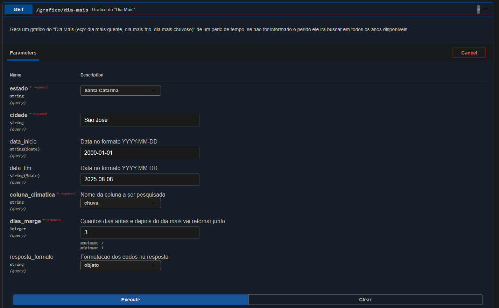
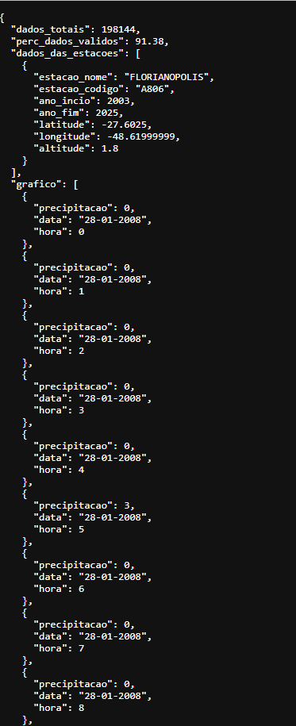

# 📍 Brasil ClimaAPI

**Brasil ClimaAPI** é uma API desenvolvida em **Python** utilizando **FastAPI** e **Pandas** que fornece dados climáticos históricos do Brasil. Site que usa ela [aqui](link para o front), ou se quiser acessar diretamente [interface da API](https://projeto-clima-web-back.onrender.com/docs) *(pode levar alguns segundos para o servidor iniciar)*.

Com esta API, é possível obter dados reais e precisos para a geração de gráficos climáticos.


---

## Princiapis rotas /Funcionalidades

- ✅ **Pesquisa Simples**  
  Gera um gráfico com parâmetros predefinidos para variáveis climáticas e modos de agrupamento.

- ✅ **Pesquisa "Dia Mais"**  
  Gera um gráfico do *dia mais* (ex.: dia mais quente, dia mais frio, dia mais chuvoso) dentro de um período informado.  
  Se o período não for informado, a busca é feita considerando todos os anos disponíveis.

- ✅ **Pesquisa Avançada**  
  Gera um gráfico com até **5 variáveis climáticas**, permitindo configuração detalhada do processamento interno. [Detalhes completos aqui](##Agrupamento-dos-dados)


---

## 🛠️ Principais Tecnologias utilizadas

- [Python] Linguagem de programaçao
- [FastAPI] Fazer o Back End
- [Pandas] Trabalhar com os dados
- [Uvicorn] para rodar o servidor

---

## 📂 Estrutura do projeto
app/  
├── main.py # Inicializa a API FastAPI  
├── api/ # Rotas da API  
├── core/ # Constantes, schemas e configs  
├── data/ # Dados em Parquet  
├── services/ # Serviços de gerar os "graficos" e funções auxiliares  
└── requirements.txt # Dependências do projeto  


## 📊 Rotas


### GET /grafico/pesquisa-simples
 

### GET /grafico/pesquisa-dia-mais
 

---

## Agrupamento dos dados

- Por padrão, as pesquisas agrupam os dados **por dia**.  
- É possível agrupar múltiplos dias para gerar gráficos mais resumidos.

---

## Filtros de Pesquisa Avançada

Formas de agrupar as **24 medições** do dia:

- `max_dia` → valor **máximo** do dia  
- `min_dia` → valor **mínimo** do dia  
- `sum_dia` → **soma** de todos os valores do dia  
- `mean_dia` → **média** dos valores do dia  

Alguns filtros precisam de **parâmetros adicionais**:

- `hora_fixa` → pega o valor da **hora** especificada    
- `hora_min_janela` → pega o **valor mínimo** dentro da janela de horas especificada    
- `hora_max_janela` → pega o **valor máximo** dentro da janela de horas especificada    
- `hora_mean_janela` → calcula a **média** dentro da janela de horas especificada    

---

## ▶️ Como rodar o projeto localmente

Clone o repositório
```bash
https://github.com/Thiago-Weiss/Projeto-Clima-Web-Back.git
```
Crie o ambiente virtual do Python
```bash
python -m venv venv
source venv/bin/activate   # Linux/Mac
venv\Scripts\activate      # Windows
```
Instale as dependencias
```bash
pip install -r requirements.txt
```
Rode o servidor
```bash
uvicorn app.main:app --reload
ou
python -m uvicorn app.main:app --reload
```
Acesse a api
```bash
http://127.0.0.1:8000/docs
```


📜 Licença
Este projeto está sob a licença MIT. Você pode usá-lo, modificá-lo e distribuí-lo livremente.

